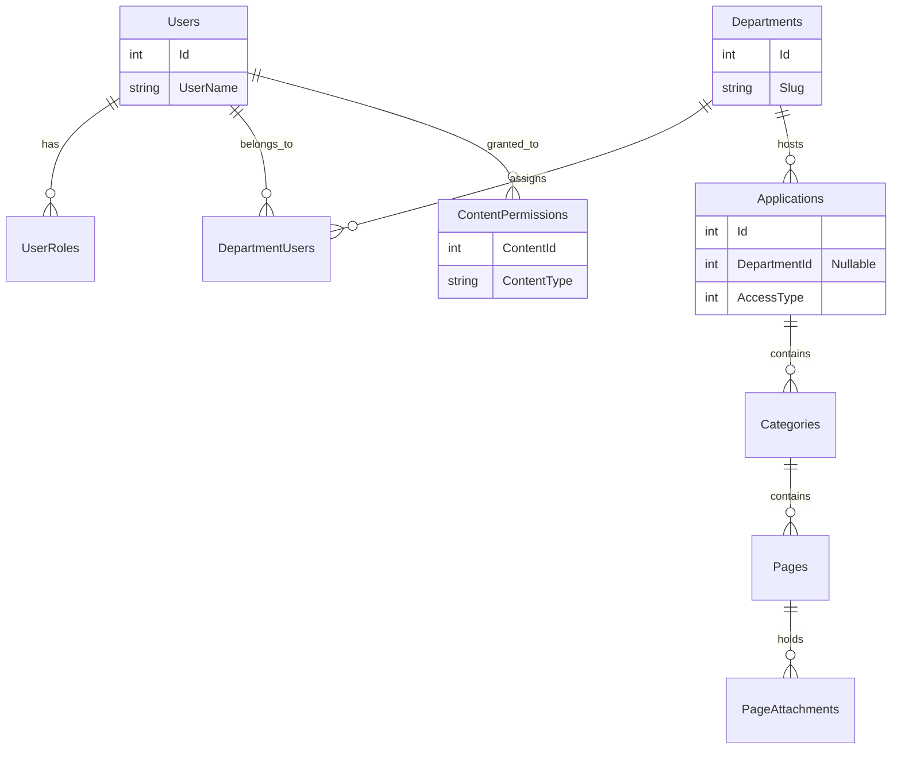

# Kılavuz - Kurumsal Kullanım Kılavuzu Yönetim Sistemi

Bu proje, kurumların veya departmanların kendilerine ait dokümantasyon, kılavuz, kural ve süreç metinlerini (application, category, page yapısı üzerinden) hiyerarşik biçimde oluşturabildiği, yönetebildiği ve güvenli bir şekilde sunabildiği bir **Kurumsal Kullanım Kılavuzu Yönetim Sistemi**'dir.

---

## 1. Proje Hakkında
Kılavuz projesi, hem kurumun geneli için "Ana Üniversite Kılavuzu" görevini üstlenebilen hem de her departmanın (ör. Bilgi İşlem, İnsan Kaynakları) kendi özel Kılavuz havuzunu (Department) barındırabildiği modüler bir dokümantasyon merkezidir.
Ziyaretçiler ve yetkisi olan çalışanlar, ön yüze girerek ilgilendikleri kılavuzları okuyabilir; departman yetkilileri ve yöneticiler (SuperAdmin) ise gelişmiş bir yönetim paneli (INSPINIA / Bootstrap) üzerinden yeni dokümanlar hazırlayabilir.

## 2. Temel Özellikler
* **Hiyerarşik Dokümantasyon:** Uygulama (Application) > Kategori (Category) > Sayfa (Page) dizilimi.
* **Departman İzolasyonu:** Her departman sadece kendi uygulamalarını yönetir; SuperAdmin tüm sistemi denetler.
* **Gelişmiş Zengin Metin Editörü:** CKEditor 5, resim/doküman yükleme, özel HTML sanitization, PDF/Word/Excel linkleme vb.
* **Erişim Kısıtlamaları:** Public (herkese açık) ve Restricted (yalnızca özel atanmış yetkililerin görebileceği) içerik ayrımları.
* **Tam Metin Arama:** Sistem genelinde uygulama, kategori veya metin sayfaları arasında hızlı arama.
* **"Sabitlenmiş" (Pinned) Kılavuzlar:** Öne çıkarılan 10 uygulamanın vitrinde gösterimi.

## 3. Teknoloji Stack
Sistem güncel .NET standartlarında ve aşağıdaki bağımlılıklarla çalışmaktadır (Mevcut koddan doğrulanmış gerçek stack):

* **Backend & Framework:** .NET 8.0, ASP.NET Core MVC (C# 12)
* **Veritabanı & ORM:** SQL Server, Dapper (doğrudan SQL sorguları ve `SqlConnectionFactory` aracılığıyla), Entity Framework Core (sadece Design/Tooling).
* **UI (Frontend & Panel):** INSPINIA Admin Theme, Bootstrap, jQuery, Select2, SweetAlert.
* **Zengin Metin Editörü:** CKEditor 5 (Özelleştirilmiş `content-file-upload-adapter` yapısı).
* **Güvenlik & Doğrulama:**
  * Cookie Authentication (`Kilavuz.Auth`)
  * `HtmlSanitizer` (Gelen zengin metinleri backend'de XSS'ten arındırmak için)
  * `RateLimiting` (Microsoft.AspNetCore.RateLimiting)
  * AI-Generated / Local CAPTCHA
* **Loglama:** Serilog (`Serilog.Sinks.MSSqlServer` ile Audit Logs ve Error Logs ayrımı).
* **Görsel İşleme:** SkiaSharp (Resim boyutlandırma/doğrulama).

---

## 4. Sistem Mimarisi

```mermaid
flowchart TD
    User([Kullanıcı / Ziyaretçi])
    UI[Public UI (MVC)]
    Panel[Yönetim Paneli (Area: Panel)]
    Controller[Controllers]
    Policy{Authorization / Resource Policy}
    Service[Generic & Özel Servisler]
    Repository[(Dapper & SQL Server)]

    User -->|Okuma/Arama| UI
    User -->|Yönetim/Giriş| Panel
    UI --> Controller
    Panel --> Policy
    Policy -->|Onay| Controller
    Policy -.->|Red| Denied[Access Denied]
    Controller --> Service
    Service --> Repository
```

---

## 5. Proje Klasör Yapısı

```text
Kilavuz.Web/
├── Application/           # Servis arayüzleri ve implementasyonları (IGenericService, vb.)
├── Areas/
│   └── Panel/             # Yönetim paneli (SuperAdmin / Yetkili arayüzleri)
│       ├── Controllers/   # Department, Application, Page, vb.
│       ├── Models/        # ViewModeller
│       └── Views/         # Admin arayüzü razor sayfaları (INSPINIA)
├── Controllers/           # Public rotalar (Home, Kilavuz, Search)
├── Data/                  # Veritabanı Factory ve Generic Repository yapıları
├── Domain/
│   ├── Entities/          # DB Tablo sınıfları (Application, Category, Department, vb.)
│   ├── Enums/             # AccessType, UserRoleType vb.
│   └── Interfaces/        # IEntity, IAuditable, ISoftDeletable arayüzleri
├── Infrastructure/
│   ├── Captcha/           # Capthcha servisleri
│   ├── Logging/           # Serilog Filter'ları
│   ├── Middleware/        # Global Hata Yakalama (GlobalExceptionHandler)
│   ├── Security/          # HTML Sanitizer, LocalAuth provider
│   └── Storage/           # Dosya ve Görsel yükleme (FileStorageService)
├── Models/                # Public view modeller
├── Views/                 # Public razor sayfaları
├── wwwroot/
│   ├── css/, js/          # INSPINIA & Custom CSS/JS
│   ├── js/ckeditor/       # Zengin Metin editörü modülleri
│   └── uploads/           # Yüklenen dosyaların dizinleri
├── Program.cs             # Servis IoC kayıtları ve Middleware akışı
└── appsettings.json       # Temel konfigürasyon
```

---

## 6. Kullanıcı Rolleri

| Rol | Public Arayüz | Panel (Dashboard) | Kendi Departman İçerikleri | Diğer Departmanlar |
|:---|:---:|:---:|:---:|:---:|
| **SuperAdmin** | Oku / Ara | Tam Erişim | Oluştur/Düzenle/Sil | Oluştur/Düzenle/Sil |
| **Yetkili** | Oku / Ara | Kısıtlı Erişim | Oluştur/Düzenle/Sil | - (IDOR korumalı) |
| **Kullanıcı** | Oku / Ara | - | - | - |

---

## 7. Departman Mimarisi

* **DepartmentEntity:** Sistemin organizasyonel kırılımlarıdır (İnsan Kaynakları, Bilgi İşlem vb.).
* **DepartmentUsers:** Bir yetkili (User), birden fazla departmana atanabilir (Many-to-Many). Controller tarafındaki Select2 yapısıyla çoklu atama desteklenir.
* **Ana Üniversite Kılavuzu:** Eğer bir `Application` nesnesinin `DepartmentId`'si `NULL` ise, bu "Ana Üniversite Kılavuzu"nda (Root) görüntülenir. `NULL` departman içeriklerini **sadece SuperAdmin** oluşturabilir veya silebilir.
* **Kalıcı URL / Slug:** Her departman, `kilavuz/{departmentSlug}` üzerinden tamamen kendisine ait özel izole bir liste (vitrin) sunar.

---

## 8. Public Kullanım Akışı

1. **Giriş Noktası (`/`):** Ziyaretçi ana sayfada, Pinned (sabitlemiş) uygulamaları, arama çubuğunu ve varsa departmanların sekmelerini görür.
2. **Kılavuz Listesi (`/kilavuz`):** Sadece `DepartmentId = NULL` olan root uygulamalar listelenir.
3. **Departman İzolesi (`/kilavuz/{slug}`):** Belirtilen departmana ait aktif/silinmemiş uygulamalar gelir.
4. **Restricted İçerik (Erişim Kontrolü):** Bir uygulama veya sayfa `AccessType.Restricted` olarak işaretlendiyse, o içeriği listelerde sadece `ContentPermissions` tablosunda kaydı bulunan ("Bu uygulamayı şu ID'li kişi görebilir") kullanıcılar görür. Direct-link ile erişilse bile login/yetki sorulur.
5. **Sayfa Gösterimi (`/kilavuz/{appId}/{catId}/{pageId}`):** Sayfa hiyerarşisi breadcrumb olmadan sol menüde bir ağaç şeklinde sunulur. CKEditor ile basılan zengin metin ekranda render edilir.

---

## 9. Yönetim Paneli

* **DepartmentController:** Departman oluşturma ve bu departmanlara yetkili kullanıcı (`DepartmentUsers`) (Select2 kullanılarak array yapısıyla) atama.
* **ApplicationController:** Departmana bağlı alt uygulama (Kılavuz Kökü) yaratma. Uygulama ikonu belirleme (FontAwesome). "SuperAdmin" iseniz root Kılavuz yaratabilirsiniz.
* **CategoryController:** Seçilen uygulama altına klasör/dizin hiyerarşisi oluşturma.
* **PageController:** Asıl dokümanın yazıldığı yer. Sıralama (MoveUp, MoveDown), CKEditor entegrasyonu, dosya ekleri (PageAttachments).
* **PermissionController:** `Restricted` (kısıtlı) içerikler için "Hangi personel bunu okuyabilir?" kuralını belirleyen arayüz.

---

## 10. Authentication & Authorization

### Authentication (Kimlik Doğrulama)
Sistem **Cookie Authentication** (`Kilavuz.Auth`) kullanmaktadır. `LocalTestAuthProvider` ile doğrulama test edilebilir şekilde açık bırakılmış/soyutlanmıştır. Login sonrası Session da destekleyici (5dk timeout) olarak aktiftir.

### Authorization (Yetkilendirme)
* **Policy Based:** `[Authorize(Policy = "SuperAdminOnly")]` gibi standart AspNetCore policy korumaları devrededir.
* **IResourceOwnershipPolicy (Resource Ownership):** İçeriğin oluşturulması, güncellenmesi veya silinmesi esnasında:
  * Kullanıcı *SuperAdmin* ise her zaman `true`.
  * Kullanıcı *Kullanıcı* ise her zaman `false`.
  * Kullanıcı *Yetkili* ise; güncellenmek istenen entity'nin (Page/Category/App) kök `DepartmentId`'sine bakılır. Eğer ilgili `DepartmentId`, kullanıcının atandığı `DepartmentUsers` listesinde varsa `true` döner, yoksa `false` döner.

---

## 11. IDOR ve Güvenlik

* **IDOR (Insecure Direct Object Reference):** Departman yöneticisi (Yetkili) başka bir departmanın içeriğini GET parametresi (`/Panel/Page/Edit/5`) ile manipüle edip çağırmaya çalışırsa, `IResourceOwnershipPolicy` arka planda bu sayfanın bağlı olduğu departmanı bularak yetki kontrolü yapar ve 403 / Hata Fırlatır. "UI'da butonu gizlemek" tek koruma değildir; **backend denetimi şarttır ve uygulanmıştır**.
* **Rate Limiting:** `LoginPolicy` ve `GlobalLimiter` devrededir. Kullanıcıların login endpointsine deneme yanılma yapmasını engeller.
* **CAPTCHA:** Giriş ekranında bot zafiyetlerine karşı koruma sağlar.
* **SQL Injection:** Tüm veritabanı işlemleri Dapper üzerinde **Parametreli Sorgular** kullanılarak inşa edilmiştir.

---

## 12. CKEditor ve Dosya Yönetimi

Sistemde gelişmiş bir dosya yönetim altyapısı vardır:
1. **İmaj Yükleme (Görsel):** Sadece `png, jpg, jpeg` gibi uzantılara izin verilir, `SkiaSharp` ile boyutları ve Magic Byte'ı (imzası) doğrulanır.
2. **Doküman Yükleme (Custom Plugin - `content-file-upload-adapter`):** CKEditor toolbar'ından Word, Excel, PDF, CSV gibi dokümanlar seçilebilir. Yükleme sonrası ekrana özel bir widget (Kutu / Kart) olarak düşer ve tıklanarak indirilebilir. 
3. **Ek (Attachment) Dosyaları:** Sayfaya bağlı `.zip` vb. dosyalar eklenebilir ve yetki çerçevesinde sunulur. Eğer ek dosyasının bağlı olduğu sayfa `Restricted` ise, ek dosyasının download uç noktası (endpoint'i) da yetki sorgular. Sunucu tarafında mutlak güvenlik sağlanır.

> Dosyalar fiziksel olarak `wwwroot/uploads` veya `App_Data/Uploads` altında UUID (GUID) formatında güvenceye alınarak saklanır. Path Traversal atakları engellenmiştir.

---

## 13. Arama Sistemi

* `SearchController` üzerinden yönetilir. 
* Kategori açıklamalarında, sayfa içeriklerinde (stripped HTML olarak) ve uygulama adlarında tam metin arama Dapper sorgularıyla yapılır. 
* **Güvenlik Çemberi:** Arama motoru, içeriği ekrana basmadan önce kullanıcının "Görmeye Yetkili" olup olmadığını (`AccessType.Public` veya izin verilenler) filtreleyip, sadece yetkisinin yettiği arama sonuçlarını (Restricted) gösterir.

---

## 14. Pinned Kılavuz Sistemi

Ana sayfada ve kılavuz vitrinlerinde gösterilen uygulamalar, `IsPinned` mantığıyla sıralanır:
* Önce **IsPinned = True** olanlar (SortOrder'a göre) getirilir.
* Eğer Pinned sayısı **10'dan azsa**, geriye kalan kontenjan (10'a tamamlama kuralı), **sabitlenmemiş ama en son eklenen** uygulamalarla doldurulur.
* Bu algoritma `KilavuzController.cs` içerisinde katı kurallarla uygulanmaktadır (Duplicates önlenir).

---

## 15. Veritabanı Yapısı

Sistem, aşağıda en temel haliyle özetlenen ilişkisel (RDBMS) bir yapıya sahiptir:



---

## 16. Configuration

`appsettings.json` üzerindeki temel yapılandırma parametreleri:
* **ConnectionStrings:** `DefaultConnection` parametresine SQL Server bağlantı dizenizi girmelisiniz. (Hassas bir sunucu bilgisi/şifre varsa bu sadece `.env` veya `UserSecrets`'ta tutulur).
* **Logging (Serilog):** Hedef veritabanındaki loglama kuralları buradan şekillenir.
* **Security:** `DisableCaptchaInDev` veya `DisableRateLimitInDev` gibi geçici ortam değişkenleriyle Development (Geliştirme) safhasında kolaylık sağlanabilir ancak Prod'a aktarılmamalıdır.

---

## 17. Kurulum

1. Bilgisayarınızda **.NET 8.0 SDK** yüklü olmalıdır.
2. Yerel bir **SQL Server** (veya SQLEXPRESS) örneğinin aktif olduğundan emin olun.
3. Proje klasörünü IDE'nizle (Visual Studio, VS Code) açın veya CLI kullanın.
4. Terminal üzerinden paket bağımlılıklarını güncelleyin: `dotnet restore`.
5. Veritabanının içi tamamen boş/hazır (`TRUNCATE` vb. sıfırlandı) durumdaysa, sadece projenizin root SQL/Migration kurulum kurallarını takip ederek DB yapısını oluşturduğunuzdan emin olun.

---

## 18. Uygulamayı Çalıştırma

Terminal veya Konsol üzerinden `Kilavuz.Web` dizinindeyken:

```bash
dotnet build
dotnet run
```
komutlarını çalıştırın. Varsayılan olarak proje, Kestrel üzerinden belirtilen portlarda (`http://localhost:5xxx` veya `https://localhost:7xxx`) yayına başlayacaktır. (Gerçek profil için `Properties/launchSettings.json` referans alınır).

---

## 19. Test ve Doğrulama
Bu projede (Mevcut kod itibarıyla) aşağıdaki senaryolar gerçek testten geçmiş ve kurallar doğrulanmıştır:
* **Department Isolation (Departman İzolasyonu):** Bir departman yetkilisi, sadece kendisine atanan bölümün içeriğini güncelleyebilir.
* **IDOR:** Linkteki sayfa kimliğini kurcalayarak başkasının dosyasını düzenleme girişimi sunucu taraflı başarıyla engellenmiştir (`ResourceOwnershipPolicy`).
* **Dosya Güvenliği:** CKEditor adapter ve `UploadAttachment` endpointlerinde Magic Byte testleri yapılmış, zararlı betik/dosya uzantılarına izin verilmediği doğrulanmıştır.
* **Sıfırlama İşlemleri:** Tüm geçici/test verileri `DELETE FROM` ile temizlenmiş, temiz kurulum denenmiştir.

---

## 20. Güvenlik Notları
1. **HtmlSanitizer** sayesinde, kullanıcı arayüzüne gönderilen içerik HTML içerse dahi `Html.Raw()` ile basılması bir risk oluşturmaz. (Yine de yalnızca Panel'den gelen veriler için kullanılır).
2. Rate Limiting ve CAPTCHA sunucunun stabilitesini sağlamak için devre dışı bırakılmamalıdır (Appsettings Production koşulları).
3. Veritabanına Dapper ile gidilirken ASLA metin birleştirme (`"SELECT * FROM X WHERE id=" + id`) kullanılmamıştır, tamamen parametreli objelerle ilerlenmiştir (`new { id = id }`).

---

## 21. Bilinen Sınırlamalar
* Sunucuya yüklenecek maksimum dosya boyutları (IFormFile ayarları) default AspNetCore limitlerindedir; çok büyük boyutlu videolara uygun değildir, belgeler/pdf'ler için tasarlanmıştır.
* C# `.csproj` içinde belirtilen uyarılar (`nullable enable` kuralları ve Dapper'daki Null referans atamaları) statik kod analizi sırasında "warning" üretebilir (Ancak uygulamanın build/run döngüsünü bozmaz).

---

## 22. Son Durum
Sistem, departman odaklı kurumsal dokümantasyon gereksinimlerini eksiksiz karşılayan, izole çalışabilen, arayüzü kullanıcı dostu ve güvenlik duvarları yüksek bir portal halini almıştır. İstendiğinde geliştirici dostu generic mimarisi (IGenericService, IGenericRepository) ile yeni varlık (Entity) eklemek oldukça pratiktir. 
